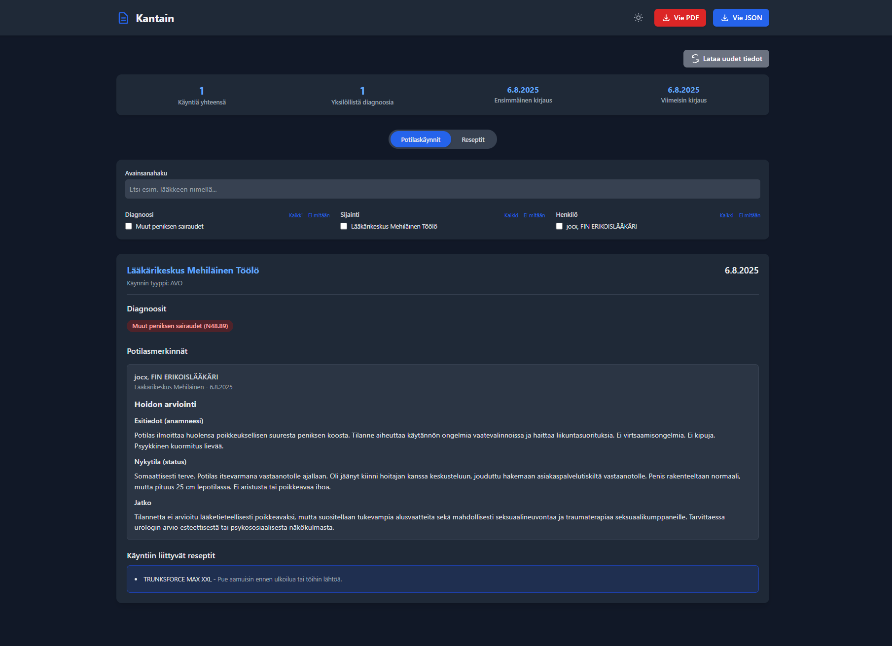

# Kantain - Kanta.fi tietojen lataus- ja katselutyökalu

Tämä työkalu mahdollistaa henkilökohtaisten terveystietojen lataamisen Kanta.fi palvelusta ja katsomisen selkeämmässä muodossa.

Työkalu mahdollistaa tällä hetkellä vain potilastietojen(tarkemmin Palvelutapahtumien) sekä reseptien lataamisen ja tarkastelun. Työn alla on saada myös laboratoriotulokset sisällytettyä työkaluun, mutta koska niitä ei ole vielä implementoitu uudella puolella, en jaksanut tehdä loppuun vanhan puolen datan parsimista.



## Käyttöohjeet

### Vaihe 1: Kirjaudu Kanta.fi palveluun

1. Mene osoitteeseen: https://www.kanta.fi
2. Käytä vahvaa tunnistautumista kirjautumiseen

### Vaihe 2: Siirry uuteen versioon

1. Kun olet kirjautunut, etsi sivulta linkki "Uusi versio" tai "Kokeile uutta versiota". Tämä vaaditaan, sillä vanha versio käyttää eri API-rajapintoja. 
2. Klikkaa sitä siirtyäksesi uuteen käyttöliittymään

### Vaihe 3: Avaa kehittäjätyökalut

1. Paina `F12` näppäintä avataksesi selaimen kehittäjätyökalut
2. Klikkaa "Console" välilehti jos se ei ole jo aktiivinen

### Vaihe 4: Lataa palvelutapahtumat

1. Avaa tiedosto `dev-tool-scripts/palvelutapahtumat.js`
2. Kopioi koko tiedoston sisältö
3. Liitä koodi selaimen konsoliin ja paina Enter
4. Odota kunnes lataus on valmis - näet edistymisen konsolissa
5. Tiedosto `palvelutapahtumat_[aikaväli].json` latautuu automaattisesti tietokoneellesi

**HUOM:** Lataus saattaa kestää useita minuutteja riippuen tietojesi määrästä.

### Vaihe 5: Lataa reseptitiedot

1. Avaa tiedosto `dev-tool-scripts/reseptit.js`
2. Kopioi koko tiedoston sisältö
3. Liitä koodi selaimen konsoliin ja paina Enter
4. Odota kunnes lataus on valmis - näet edistymisen konsolissa
5. Tiedosto `reseptit_[aikaväli].json` latautuu automaattisesti tietokoneellesi

### Vaihe 6: Katso tietoja

1. Lataa `kantain.html` tiedosto tietokoneellesi tästä repositoriosta
2. Avaa tiedosto selaimessa kaksoisklikkaamalla sitä
3. Kopioi ladattujen JSON-tiedostojen sisältö vastaaviin tekstilaatikkoihin
4. Selaa ja tutki tietojasi käyttöliittymän kautta

## Tiedostot

- `dev-tool-scripts/palvelutapahtumat.js` - Scripti palvelutapahtumien lataamiseen
- `dev-tool-scripts/reseptit.js` - Scripti reseptitietojen lataamiseen  
- `kantain.html` - Käyttöliittymä ladatuille tiedoille

## Tietoturva

- Kaikki tiedot pysyvät paikallisesti tietokoneellasi
- Ei lähetä tietoja ulkopuolisille palvelimille
- Käyttää Kanta.fi:n omia API-rajapintoja datan hakemiseen

## Aikavälin muuttaminen

Scriptit hakevat tiedot 1.5.2010-nykypäivä ajalta. Alkupäivämäärä on tuo, sillä kanta ilmoittaa, että tietoja ei ole saatavilla ennen sitä. Voit muuttaa scripteissä olevaa päivämäärää, jos haluat hakea tietoja alkaen jostain toisesta ajankohdasta. 

```javascript
    const startDate = new Date('2010-05-01'); //muuta tätä päivämäärää muuttaaksesi haun alkuajankohtaa.
```
