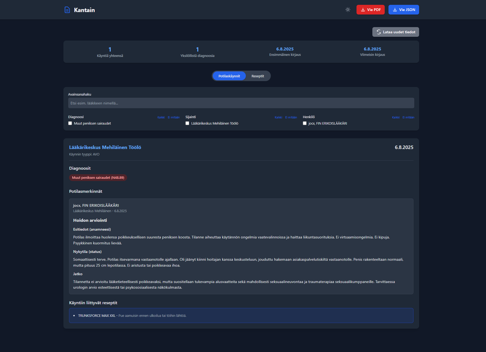

# Kantain - Kanta.fi tietojen lataus- ja katselutyökalu

Tämä työkalu mahdollistaa henkilökohtaisten terveystietojen lataamisen Kanta.fi palvelusta ja katsomisen selkeämmässä muodossa.

Työkalu näyttää potilaskäynnit, reseptit ja laboratoriotulokset. Kaikki näkymät ja laboratorioiden kaaviot sisältyvät yhteen `kantain.html`-tiedostoon. Avaa se kaksoisklikkaamalla. Käyttäjän ei tarvitse asentaa ohjelmia tai käynnistää palvelinta.



## Käyttöohjeet

### Vaihe 1: Kirjaudu Kanta.fi palveluun

1. Mene osoitteeseen: https://www.kanta.fi
2. Käytä vahvaa tunnistautumista kirjautumiseen

### Vaihe 2: Siirry uuteen versioon

1. Kun olet kirjautunut, etsi sivulta linkki "Uusi versio" tai "Kokeile uutta versiota". Tämä vaaditaan, sillä vanha versio käyttää eri API-rajapintoja. 
2. Klikkaa sitä siirtyäksesi uuteen käyttöliittymään

### Vaihe 3: Avaa kehittäjätyökalut

1. Paina `F12` näppäintä avataksesi selaimen kehittäjätyökalut
2. Klikkaa "Console" välilehti jos se ei ole jo aktiivinen

### Vaihe 4: Lataa palvelutapahtumat

1. Avaa tiedosto `dev-tool-scripts/palvelutapahtumat.js`
2. Kopioi koko tiedoston sisältö
3. Liitä koodi selaimen konsoliin ja paina Enter
4. Odota kunnes lataus on valmis - näet edistymisen konsolissa
5. Tiedosto `palvelutapahtumat_[aikaväli].json` latautuu automaattisesti tietokoneellesi

**HUOM:** Lataus saattaa kestää useita minuutteja riippuen tietojesi määrästä. Voit myös ladata kaikki tiedot yhdellä scriptillä `dev-tool-scripts/kaikki-tiedot.js`

### Vaihe 5: Lataa reseptitiedot

1. Avaa tiedosto `dev-tool-scripts/reseptit.js` (tai `dev-tool-scripts/kaikki-tiedot.js`)
2. Kopioi koko tiedoston sisältö
3. Liitä koodi selaimen konsoliin ja paina Enter
4. Odota kunnes lataus on valmis - näet edistymisen konsolissa
5. Tiedosto `reseptit_[aikaväli].json` latautuu automaattisesti tietokoneellesi

### Vaihe 6: Lataa laboratoriotulokset

1. Avaa `dev-tool-scripts/laboratoriotutkimukset.js`.
2. Kopioi sen sisältö OmaKannan uuden version selaimen konsoliin ja suorita.
3. Odota valmistumista. Skripti lataa yhden `laboratoriotutkimukset_[aikaväli].json`-tiedoston.

Haku käy läpi kaikki tuloslistan sivut aikavälillä 1.5.2010–tänään sekä jokaisen tuloskokonaisuuden ja tutkimuksen tarkemmat tiedot. Se säilyttää myös tekstivastaukset, lausunnot, yksiköt, näyteajat, viitearvot ja käyntiviitteet. Haettavissa ovat OmaKannassa käyttäjälle näkyvät tulokset; julkaisemattomia tai Kantaan tallentamattomia tietoja ei voida hakea.

Jos haku epäonnistuu tai kirjautuminen vanhenee, jo haetut tiedot tallentuvat `KESKENERAINEN`-nimiseen tiedostoon. Näkymä ilmoittaa puutteellisuudesta. Haku voidaan keskeyttää konsolissa kutsulla `kantainLabDownload.cancel()`. Tiedoston voi ladata uudelleen kutsulla `kantainLabDownload.save()`.

### Kaikki tiedot yhdellä haulla

Suorita `dev-tool-scripts/kaikki-tiedot.js` OmaKannan uuden version konsolissa. Se lataa potilaskäynnit sisältöineen, reseptit versioineen ja lokeineen sekä laboratoriotulokset yhteen `kantain_[aikaväli].json`-tiedostoon. Valitse Kantaimessa **yksi tietue** ja tuo tiedosto. Haku käy läpi kaikki sivut aikaväliltä 1.5.2010–tänään. Epäonnistunut haku säilyttää saatavilla olevat tiedot `KESKENERAINEN`-tiedostossa.

### Vaihe 7: Katso tietoja

1. Lataa `kantain.html` tiedosto tietokoneellesi tästä repositoriosta
2. Avaa tiedosto selaimessa kaksoisklikkaamalla sitä
3. Valitse **3 datasettiä** erillisille tiedostoille tai **Yksi datasetti** yhdistetylle tiedostolle. Pudota tiedostot kenttiin tai valitse ne klikkaamalla.
4. Paina **Käsittele tiedot**. Pelkät laboratoriotuloksetkin riittävät.
5. Selaa ja tutki tietojasi käyttöliittymän kautta

### Linkitetty JSON

**Vie JSON → Kaikki tiedot linkitettyinä** tallentaa kaiken ladatun aineiston näkymän rajauksista riippumatta. **Alkuperäiset tiedot** säilyttää aiemman vientimuodon. Molemmat voi tuoda takaisin valinnalla **yksi tietue**.

Linkitetyn tiedoston muoto on `kantain-linked-v1`. `labTests` sisältää yhden objektin kutakin tutkimustyyppiä kohden. Sen `results`-taulukossa ovat kaikki tutkimuksen tulokset vanhimmasta uusimpaan. Puuttuvat päivämäärät sijoitetaan loppuun. Tuloksesta löytyvät suoraan arvo, alkuperäinen vastaus, yksikkö, mahdollinen yksikön päättely, viitearvot ja ajankohta.

```javascript
const [id] = data.indexes.labTestIdsByName['B -Basofiiliset leukosyytit'];
const tutkimus = data.labTests[id];
console.log(tutkimus.results);
```

`visits`, `prescriptions`, `labEvents` ja `labStudies` ovat tunnisteella avattavia objektihakemistoja. Tuloksen `visitId`, `testId`, `eventId` ja `studyId` osoittavat niihin. Käynti sisältää vastaavasti `labResultIds`, `labTestIds` ja `prescriptionIds`. Tulostunnisteen sijainti löytyy suoraan `indexes.labResultLocations`-hakemistosta, joten kaikkia tutkimuksia ei tarvitse selata. Alkuperäiset tarkemmat tiedot säilyvät tietueiden `source`-kentissä.

Tunnisteet muodostetaan deterministisesti alkuperäisestä pysyvästä tunnisteesta tai tietosisällöstä. Sisällöltään muuttuva tutkimusversio voi saada uuden tunnisteen. `visitLinkBasis` ja `visitLinks[].basis` erottavat OmaKannan viitteet reseptien päivämäärään perustuvista päätelmistä.

### Tutkimusten tietopaketit

HTML sisältää lyhyet tietopaketit Terveyskirjaston hakemiston kaikista 79 artikkelista. Jokaisessa tietopaketissa on lähdeartikkelin linkki ja tarkistuspäivä.


## Tiedostot

- `dev-tool-scripts/palvelutapahtumat.js` - Scripti palvelutapahtumien lataamiseen
- `dev-tool-scripts/reseptit.js` - Scripti reseptitietojen lataamiseen  
- `dev-tool-scripts/laboratoriotutkimukset.js` - Laboratoriotulosten ja käyntiviitteiden lataus
- `dev-tool-scripts/kaikki-tiedot.js` - Kaikki kolme tietotyyppiä yhdellä haulla
- `kantain.html` - Käyttöliittymä ladatuille tiedoille


## Tietoturva

- Kaikki tiedot pysyvät paikallisesti tietokoneellasi
- Ei lähetä tietoja ulkopuolisille palvelimille
- Käyttää Kanta.fi:n omia API-rajapintoja datan hakemiseen

## Aikavälin muuttaminen

Scriptit hakevat tiedot 1.5.2010-nykypäivä ajalta. Alkupäivämäärä on tuo, sillä kanta ilmoittaa, että tietoja ei ole saatavilla ennen sitä. (Tämä voi olla yksilöön sidottu arvo, joten kannattaa testata myös aiempia päivämääriä) Voit muuttaa scripteissä olevaa päivämäärää, jos haluat hakea tietoja alkaen jostain toisesta ajankohdasta. 

```javascript
    const startDate = new Date('2010-05-01'); //muuta tätä päivämäärää muuttaaksesi haun alkuajankohtaa.
```
